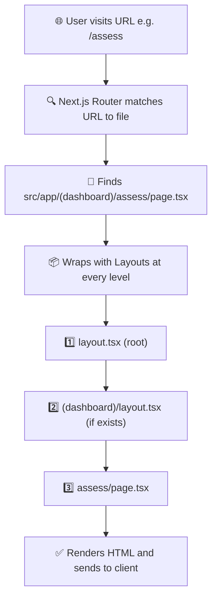
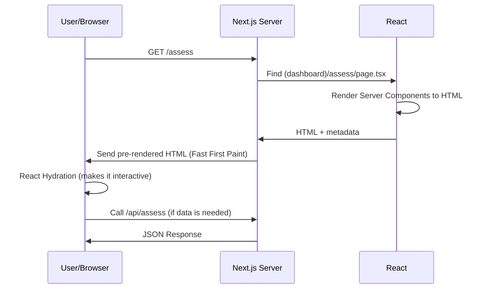

# 📖 RalphGuard Frontend — Project Structure Overview

> **RalphGuard** is an **In-silico Irritation & Toxicity Risk Screening** platform,
> built with **Next.js 14** + **TypeScript** + **TailwindCSS** + **Three.js**

---

## 🏗️ Root-Level Config Files

| File | Description |
|---|---|
| [package.json](file:///e:/ralphguard/frontend/package.json) | Defines dependencies and scripts (`dev`, `build`, `start`, `lint`, `type-check`) |
| [next.config.js](file:///e:/ralphguard/frontend/next.config.js) | Next.js config — enables `reactStrictMode` and transpiles the `three` package |
| [tsconfig.json](file:///e:/ralphguard/frontend/tsconfig.json) | TypeScript config — target ES2022, path alias `@/*` pointing to root |
| [tailwind.config.js](file:///e:/ralphguard/frontend/tailwind.config.js) | Tailwind config — custom colors (ink, panel, brand, risk levels), fonts (Space Grotesk, IBM Plex Mono) |
| [postcss.config.js](file:///e:/ralphguard/frontend/postcss.config.js) | PostCSS config for Tailwind + autoprefixer |
| [Dockerfile](file:///e:/ralphguard/frontend/Dockerfile) | Docker image for dev mode (Node 20 Alpine, exposes port 3000) |
| `next-env.d.ts` | Auto-generated by Next.js to provide TypeScript type definitions |

> [!NOTE]
> `node_modules/` contains installed dependencies and `.next/` is the build output folder auto-generated by Next.js — neither should be manually edited.

---

## 📁 `public/` — Static Assets

```
public/
├── icons/    ← Icon assets (empty)
├── images/   ← Image assets (empty)
└── models/   ← 3D models for Three.js (empty)
```

Files in `public/` are served directly via URL (e.g., `/images/logo.png`) without needing to import them. Currently all folders are empty, awaiting assets.

---

## 📁 `src/app/` — App Router (The Heart of Next.js 14)

### Root-Level Files

| File | Description |
|---|---|
| [layout.tsx](file:///e:/ralphguard/frontend/src/app/layout.tsx) | **Root Layout** — wraps every page, sets `<html lang="th">`, imports `globals.css`, defines metadata (title, description) |
| [page.tsx](file:///e:/ralphguard/frontend/src/app/page.tsx) | **Home Page** (`/`) — displays "RalphGuard" centered on screen |
| [globals.css](file:///e:/ralphguard/frontend/src/app/globals.css) | **Global CSS** — imports Tailwind directives, sets CSS variables (background `#0A1213`, foreground `#E8F1EF`) |

---

### 🔀 Route Groups — Organize Pages Without Affecting URLs

Folders wrapped in **parentheses** like `(auth)` are **Route Groups** — they don't create URL segments but help organize pages. Each group can have its own `layout.tsx`.

#### `(auth)/` — Authentication Pages

```
(auth)/
├── login/        ← URL: /login (empty)
└── register/     ← URL: /register (empty)
```

Used for Login/Register pages, which may have a layout without a sidebar.

#### `(dashboard)/` — Dashboard Pages

```
(dashboard)/
├── assess/       ← URL: /assess ✅ (has page.tsx)
├── dashboard/    ← URL: /dashboard (empty)
└── home/         ← URL: /home (empty)
```

Dashboard pages will share a common layout with sidebar and header.

> [!IMPORTANT]
> Currently only [assess/page.tsx](file:///e:/ralphguard/frontend/src/app/(dashboard)/assess/page.tsx) has content — it's a placeholder stating it will integrate **Formula Builder + 3D Anatomy + Assessment Results**.

#### `(marketing)/` — Marketing / Landing Pages

Empty — intended for Landing Page, About Us, etc.

---

### 🔒 Private Folders — Internal Code (Not Routes)

Folders prefixed with an **underscore** `_` are **not** treated as routes by Next.js — they store shared code across pages.

| Folder | Purpose | Status |
|---|---|---|
| `_components/ui/` | Basic UI components (buttons, inputs, cards, etc.) | Empty |
| `_components/layout/` | Layout components (sidebar, header, navbar) | Empty |
| `_components/three/` | 3D components using Three.js / React Three Fiber | Empty |
| `_components/chemistry/` | Chemistry-specific components (molecules, formulas) | Empty |
| `_hooks/` | Custom React Hooks | Empty |
| `_lib/` | Utility functions, API client (axios config) | Empty |
| `_types/` | TypeScript type/interface definitions | Empty |

---

### 🌐 API Routes — Backend Endpoints

```
api/
├── assess/       ← /api/assess (empty)
├── projects/     ← /api/projects (empty)
└── substances/   ← /api/substances (empty)
```

API Routes allow creating backend endpoints directly within Next.js using `route.ts` files — no separate server needed.

---

## 📦 Key Dependencies

### Runtime Dependencies

| Package | Version | Purpose |
|---|---|---|
| `next` | 14.2.13 | Core framework (SSR, routing, API) |
| `react` + `react-dom` | ^18.3.1 | UI Library |
| `@react-three/fiber` | ^8.17.10 | React renderer for Three.js |
| `@react-three/drei` | ^9.114.3 | Helper components for Three.js |
| `three` | ^0.169.0 | 3D rendering engine |
| `recharts` | ^2.12.7 | Charts and graphs |
| `axios` | ^1.18.0 | HTTP client for API calls |
| `lucide-react` | ^0.446.0 | SVG icon library |
| `clsx` | ^2.1.1 | Utility for conditional class names |

### Dev Dependencies

| Package | Purpose |
|---|---|
| `typescript` | Type checking |
| `tailwindcss` + `postcss` + `autoprefixer` | Styling pipeline |
| `eslint` + `eslint-config-next` | Code linting |
| `@types/*` | TypeScript type definitions |

---

## ⚙️ How Does the Next.js App Router Work?



### 1. File-based Routing — Folder Structure = Automatic URLs

```
src/app/page.tsx                        → /
src/app/(dashboard)/assess/page.tsx     → /assess
src/app/(dashboard)/dashboard/page.tsx  → /dashboard
src/app/(auth)/login/page.tsx           → /login
src/app/(auth)/register/page.tsx        → /register
```

- Folders with parentheses `(auth)`, `(dashboard)` → **do not appear in the URL**
- Each route must have a `page.tsx` file to be renderable

### 2. Layout Nesting — Layouts Wrap Automatically

```
Root Layout (layout.tsx)
  └── Dashboard Layout ((dashboard)/layout.tsx) — if exists
        └── Page Content (assess/page.tsx)
```

- `layout.tsx` wraps all child pages
- When navigating between pages, **layouts don't re-render** → very fast transitions
- Ideal for shared UI like sidebars and headers

### 3. Server Components — Default Rendering on the Server

- Every component is a **Server Component** by default
- The server pre-renders HTML → sends it to the browser → fast load + great SEO
- **Cannot** use `useState`, `useEffect`, `onClick`, or other client-side APIs

### 4. Client Components — When Interactivity Is Needed

```tsx
"use client";  // ← Add this as the first line

import { useState } from "react";

export default function Counter() {
  const [count, setCount] = useState(0);
  return <button onClick={() => setCount(count + 1)}>{count}</button>;
}
```

- Required when using `useState`, `useEffect`, event handlers, Three.js, etc.
- JavaScript bundle is shipped to the browser

### 5. API Routes — Built-in Backend

```
src/app/api/assess/route.ts → /api/assess
```

```tsx
// Example route.ts
import { NextResponse } from "next/server";

export async function POST(request: Request) {
  const body = await request.json();
  // Process...
  return NextResponse.json({ result: "..." });
}
```

- Create REST APIs without needing a separate Express/Fastify server
- Supports GET, POST, PUT, DELETE, etc.

### 6. Request Flow Summary



---

## 📊 Current Project Status

| Section | Status | Details |
|---|---|---|
| Root Layout + Global CSS | ✅ Done | Thai language set, dark theme, Tailwind configured |
| Home Page (`/`) | ⚠️ Placeholder | Only displays "RalphGuard" |
| Assess Page (`/assess`) | ⚠️ Placeholder | States it will integrate Formula Builder + 3D Anatomy |
| Login / Register Pages | 🔲 Empty | No `page.tsx` yet |
| Dashboard / Home Pages | 🔲 Empty | No `page.tsx` yet |
| Components (UI/Layout/3D/Chemistry) | 🔲 Empty | Folder structure ready, no files yet |
| Hooks / Lib / Types | 🔲 Empty | No files yet |
| API Routes | 🔲 Empty | No `route.ts` yet |
| Static Assets (icons/images/models) | 🔲 Empty | No files yet |

> [!WARNING]
> The project is in the **scaffolding phase** — the folder structure is well-organized but most components, pages, and APIs still need to be developed.

---

## 🎨 Design System Configuration

### Colors (from [tailwind.config.js](file:///e:/ralphguard/frontend/tailwind.config.js))

| Token | Color | Purpose |
|---|---|---|
| `ink` | `#0A1213` | Primary background (darkest) |
| `panel` | `#0F1C1E` | Panel background |
| `panel2` | `#14282A` | Secondary panel background |
| `elevated` | `#173032` | Elevated surface background |
| `border` | `#1F3A3C` | Borders |
| `brand` | `#2DD4BF` | Primary brand color (Teal) |
| `risk.low` | `#34D399` | Low risk (Green) |
| `risk.mod` | `#FBBF24` | Moderate risk (Yellow) |
| `risk.high` | `#FB6F70` | High risk (Red) |

### Fonts

| Token | Font | Purpose |
|---|---|---|
| `font-display` | Space Grotesk | Headings, important text |
| `font-mono` | IBM Plex Mono | Code, technical data |
